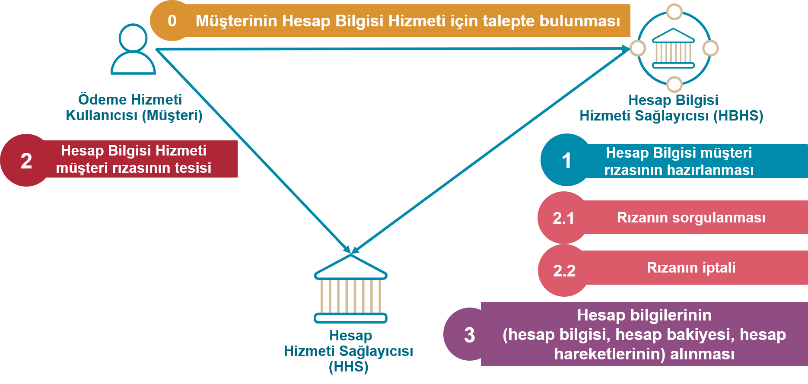
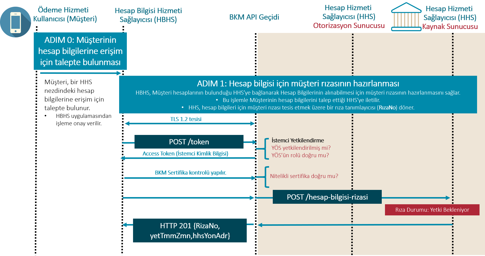

# 7.	Hesap Bilgisi Hizmeti <!-- omit in toc -->

- [Genel Bilgiler](#genel-bilgiler)
- [Hesap Bilgisi Hizmeti İçin Erişim Adresleri](#hesap-bilgisi-hizmeti-icin-erisim-adresleri)
- [ADIM 0 - ÖHK Talebi](#adim-0-ohk-talebi)
- [ADIM 1 - Hesap Bilgisi Müşteri Rızasının Hazırlanması](#adim-1-hesap-bilgisi-musteri-rizasinin-hazirlanması)
  - [Başarılı İstek](#hesap-bilgisi-rizasi-basarili-istek)
  - [Başarılı Yanıt](#hesap-bilgisi-rizasi-basarili-yanit)
  - [İzinler](#izinler)

## Genel Bilgiler

Hesap bilgisi sorgulama için HBHS tarafından müşteri rızası tesisinin HHS tamamlanmış olması gerekir. Müşteri rızası tesisi tamamlandıktan sonra, HBHS sorgulamak istediği hesaba ait verileri ilgili erişim adresi üzerinden sorgular.

Şekil 10: Hesap Bilgisi Hizmeti Üst Düzey Akışı

Şekil-10’da sunulan hesap bilgisi hizmeti 5 temel akıştan oluşur:

0.	Müşterinin hesap bilgilerine erişim için talepte bulunması: ÖHK ÖBHS mobil uygulama ya da web sitesinden hesap bilgilerine erişim işlemini başlatır. 

1.	Hesap Bilgisi müşteri rızasının hazırlanması:

HBHS, “hesap bilgilerine erişim” için müşteri rızası tesisi amacıyla HHS’deki hesap bilgisi rızası erişim adresine bir POST isteğinde bulunur ve bir hesap bilgisi rızası nesnesi oluşturur. HHS hesap bilgisi rızası nesnesi için biricik tanımlayacı döner (RızaNo). Hesap bilgisi rızası, müşterinin HBHS’nin hesap bilgilerine erişim izin verdiği alanları içerir:

  - İzinler - erişim için izin verilen veri kümelerinin listesi.
  - Erişimin Geçerli Olduğu Son Tarih - HBHS'nin müşterinin hesap bilgilerine erişebileceği isteğe bağlı seçilebilen son tarih.
  - İşlem Sorgulama Başlangıç Zamanı – Müşteri rızasının tesisinden itibaren geriye dönük olarak HBHS’nin hesap bilgilerine erişebileceği süreyi
  - İşlem Sorgulama Bitiş Zamanı - Müşteri rızasının tesisinden itibaren ileriye dönük olarak HBHS’nin hesap bilgilerine erişebileceği süreyi

2.	Hesap bilgisi hizmeti müşteri rızasının tesisi: 

HHS, Hesap Bilgisi Rızası servisi ile ÖHK özelinde “Yetki bekleniyor” statüsünde bir rıza nesnesi hazırlar. HHS, GKD’nin başarıyla tamamlanması sonrasında hesap bilgisi rızası nesnesinin yetkilendirildiğini belirtmek için Rıza Durumunu “Rıza Yetkilendirildi” olarak günceller. Nesne yetkilendirildikten sonra HHS nesne ile bir erişim belirteci (access token) ilişkilendirir, Rıza Durumunu “Yetki Kullanıldı” yapar ve bu belirteci HBHS’ye geri döner.  Böylece müşteri rıza tesisi sağlanmış olur.

Hesap bilgisi için müşteri rızasına ilişkin temel ilkeler şunlardır:

- 1 ÖHK'nın 1 YÖS için 1HHS'de Yetki Bekleniyor, Yetkilendirildi, Yetki Kullanıldı statüsünde 1 rızası olabilir. 
- Müşteri rızasının ayrıntıları ÖHK ile HBHS arasında belirlenir. Bu nedenle müşteri rızasının ayrıntıları HHS ekranında değiştirilmemelidir. 
- ÖHK, hesap erişim izni ayrıntılarını yalnızca bir bütün olarak yetkilendirebilir veya geri alabilir.
- Müşteri rızası tesisi esnasında, müşteri HHS arayüzünde erişim için yetkilendirecek hesapları seçer.

2.1	Hesap bilgisi rızasının sorgulanması: Müşteri rızası GET/hesap-bilgisi-rizasi/{RizaNo} çağrısı yapılarak sorgulanır.

2.2	Hesap bilgisi müşteri rızasının iptali: Müşteri rızası DELETE/hesap-bilgisi-rizasi/{RizaNo} çağrısı yapılarak iptal edilir.

3.	Hesap bilgilerinin alınması: Hesap bilgileri ilgili kaynağa (hesaplar, bakiye, işlemler) GET isteği yapılarak gerçekleştirilir. HBHS, müşteri rızasının tesisinden sonrasında (geçerli bir erişim belirticine sahip olduğunda) öncelikle GET/hesaplar çağrısı yapacaktır.

## Hesap Bilgisi Hizmeti İçin Erişim Adresleri

**Etki Alanı (Scope) =“hesap_bilgisi”**

|No  |Kaynak |HTTP işlemi|Erişim Adresi |Zorunlu / İsteğe Bağlı|Yetkilendirme Türü |İmzalama |Parametre |İstem Nesnesi |Yanıt Nesnesi |
| --- |--- |--- |--- |--- |--- |--- |--- |--- |--- |
| 1 |hesap-bilgisi-rizasi |POST |/hesap-bilgisi-rizasi | Z |İstemci Kimlik Bilgileri |İmzalı İstek ve Yanıt | |HesapBilgisiRizasiIstegi | HesapBilgisiRizasi|
| 2 |erisim-belirteci  (GKD için) |POST |POST/erisim-belirteci | Z |İstemci Kimlik Bilgileri |İmzalı İstek ve Yanıt | |ErisimBelirteciIstegi | ErisimBelirteci|
| 2.1 |hesap-bilgisi-rizasi |GET |/hesap-bilgisi-rizasi/{RizaNo} | Z |İstemci Kimlik Bilgileri |İmzalı Yanıt | | | HesapBilgisiRizasi|
| 2.2 |hesap-bilgisi-rizasi |DELETE |/hesap-bilgisi-rizasi/{RizaNo} | Z |İstemci Kimlik Bilgileri |  | | | |
| 3.1 |hesaplar |GET |/hesaplar | Z |İstemci Kimlik Bilgileri ve Yetkilendirme Kodu (GKD) |  | Sayfalama | |HesapBilgileri(birden çok hesap) |
| 3.2 |hesaplar |GET |/hesaplar/{hspRef} | Z |İstemci Kimlik Bilgileri ve Yetkilendirme Kodu (GKD) |  | Sayfalama | |HesapBilgileri(tek  hesap) |
| 3.3 |bakiye  |GET |/hesaplar/{hspRef}/bakiye | Z |İstemci Kimlik Bilgileri ve Yetkilendirme Kodu (GKD) |  |  | |BakiyeBilgileri(tek  hesap) |
| 3.3 |bakiye  |GET |/bakiye | İ |İstemci Kimlik Bilgileri ve Yetkilendirme Kodu (GKD) |  |Sayfalama  | |BakiyeBilgileri(birden çok hesap) |
| 3.3 |islemler  |GET |/hesaplar/{hspRef}/işlemler | Z |İstemci Kimlik Bilgileri ve Yetkilendirme Kodu (GKD) |  |Sayfalama Filtreleme  | |IslemBilgileri (tek hesap) |

Tablo 11: Hesap Bilgisi Hizmeti İçin Erişim Adresleri

## ADIM 0 - ÖHK Talebi

Hesap bilgisi sorgulama için HBHS tarafından müşteri rızası tesisinin HHS tamamlanmış olması gerekir. Müşteri rızası tesisi tamamlandıktan sonra, HBHS sorgulamak istediği hesaba ait verileri ilgili erişim adresi üzerinden sorgular.

## ADIM 1 - Hesap Bilgisi Müşteri Rızasının Hazırlanması

Bu API çağrısı HBHS'nin HHS'de yeni bir “HesapBilgisiRizasi” nesnesi oluşturmasını ve nesneye erişmek için benzersiz bir rıza numarası ({RizaNo}) dönülmesini sağlar. 

API çağrısının başarıyla sonuçlanması için HBHS'nin istemci kimlik bilgileri yetkisi kullanması yeterlidir. 
Başarıyla oluşturulan hesap bilgisi rıza kaynağının rıza durumu “Yetki Bekleniyor” olarak düzenlenir.
ÖHK daha önce aldığı rızaya ilişkin erişim tarihleri, izin türlerini ve hesap bilgilerini güncellemek isterse, HBHS önce HHS nezdindeki rızayı iptal etmeli ve sonrasında yeni bir rıza talebinde bulunmalıdır. 

Şekil 11: Hesap Bilgisi Müşteri Rızasının Hazırlanması

- POST /hesap-bilgisi-rizasi isteğinin (REQUEST) gövdesinde (BODY)  “HesapBilgisiRizasıIstegi” nesnesi (Tablo-12) kullanılır. İstek başarıyla sonuçlanırsa HHS kaynak sunucusunda “HesapBilgisiRizasi” (Tablo-13) nesnesi oluşturulur.

**POST /hesap-bilgisi-rizasi**

## Başarılı İstek:

İSTEK:

HBHS, bu API erişim adresinden HHS’ye yeni bir HesapBilgisiRizasi oluşturulması için istekte bulunur:
-	HBHS, ÖHK’nın hesap bilgilerine yönelik rıza başlatma isteği olduğunu HHS’ye bildirir.
-	HBHS, ÖHK’nın, HBHS arayüzünden verdiği rızanın (“Ön Onay”) bir kopyasının HHS nezdinde müşteri tarafından onaylanması için HHS’ye gönderilmesini sağlar.
-	HHS; istek mesajında yer alan alanların API dökümanında belirtilen şartları sağlayacak şekilde zorunluluk ve uzunluk kontrollerini yapar. (Zorunlu)
-	HHS; YÖS API ile alınan HBHS bilgilerinin içerisinde yer alan yönlendirme ve bildirim adresleri ile ödeme emri rızası nesnesi request mesajında paylaşılan adreslerin uyumlu olup olmadığının kontrollerini yapar. (Zorunlu)
-	HHS; kimlik bilgileri nesnesinde iletilen kimlik bilgileri ile ÖHK’nın HHS müşterisi olup olmadığının kontrollerini yapar. Bu kontrol hem bireysel hem de kurumsal ÖHK’lar için yapılmalıdır.  (Zorunlu)
-	Erişimin Geçerli Olduğu Son Tarih, İşlem Sorgulama Başlangıç Zamanı, İşlem Sorgulama Bitiş Zamanı alanları ile ilgili Tablo12’de belirtilen kontroller yapılmalıdır. (Zorunlu)
-	HHS, benzersiz “RizaNo” ile “HesapBilgisiRizasi” nesnesi oluşturur ve HBHS’ye döner.
-	HHS, HesapBilgisiRizasi oluşturduğu anda durumunu “Yetki Bekleniyor” olarak düzenler.

Erişimin Geçerli Olduğu Son Tarih, İşlem Sorgulama Başlangıç Zamanı, İşlem Sorgulama Bitiş Zamanı alanlarında zaman aralıkları müşteri deneyimi penceresinden değerlendirilerek ay cinsinden belirtilmiştir. Bu konuda aşağıdaki gibi oluşabilecek uç örneklere dikkat edilmesi gerekmektedir.  

Bugün : 31.08.2019  
Bugün + 6 Ay : 29.02.2020  
Bugün : 30.08.2020  
Bugün + 6 Ay : 28.02.2021

**Tablo 12: “HesapBilgisiRizasiIstegi” nesnesi**
|Alan Adı |JSON Alan Adı	|Format	|Zorunlu / Koşullu /  İsteğe bağlı	|Açıklama	|HHS tarafından yapılması gereken kontrol ve işlemler|
| --- | --- | --- | --- | --- | --- |
| Katılımcı Bilgisi | katilimciBlg |Kompleks:KatilimciBilgisi | Z | Katılımcılara atanmış kod bilgileridir. |  |
| >Hesap Hizmeti Sağlayıcısı Kodu | hhsKod | AN4 | Z | İsteğin iletildiği Hesap Hizmeti Sağlayıcısının kodudur. (Nezdinde ÖH bulunduran kuruluş kodu. Örneğin, Banka, Elektronik Para Kuruluşu ve Ödeme Kuruluşu) |	HHS, hhsKod’un kendisine ait olduğunu ve istek başlığındaki x-aspsp-code değeri ile aynı olduğunu kontrol eder. Hata durumunda TR.OBHS.Connection.InvalidASPSP hata kodunu döner. |
|> Yetkili Ödeme Hizmeti Sağlayıcısı Kodu | yosKod | AN4 | Z | İsteği gönderen Yetkili Ödeme Hizmeti Sağlayıcısı (YÖS) kodudur | HHS, yosKod’un geçerli bir Ödeme Hizmeti Sağlayıcısı Kodu olduğunu ve istek başlığındaki x-tpp-code değeri ile aynı olduğunu kontrol eder.  Hata durumunda TR.OBHS.Connection.InvalidTPP hata kodunu döner. |
| --- | --- | --- | --- | --- | --- |
				
					
